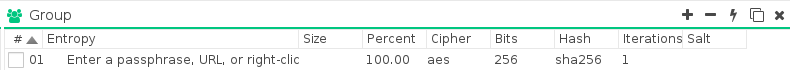
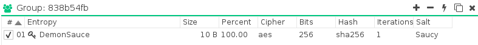
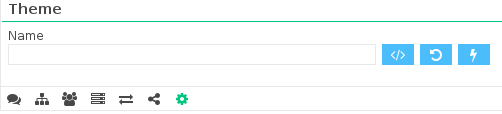

# Getting Started
---
## Download Demonsaw

First thing first! You need to <a href="https://demonsaw.com/" target="_blank">download Demonsaw</a>!

Demonsaw is provided without installers, as a stand-alone application so that it can be run from or stashed anywhere you want. Just download the version you need for your operating system, extract it somewhere, and launch Demonsaw.

---

## Manage Client Settings
### Add a Client
Demonsaw allows you to add as many clients as you need so that you can connect to other private groups and routers.

#### To add a client:

* Click the  at the very top left of the demonsaw window.
* Fill out the new client wizard or click cancel and set the client name and color manually from the options tab.

#### Enable/Disable a client:
 * Simply double-click on the client icon that you wish to enable/disable

### Sharing Files
#### Add files or folders to your shares

* Select the Message Router tab in the center of Demonsaw 
* Click the add button  at the top right of the Shares pane
* Select a file or folder to share (repeat as needed)
* Press the lightning icon  at the top right of the Shares pane to apply the settings

### Add / Create Groups
Groups in Demonsaw allow you to add additional layers of cryptography to your connection with the Demonsaw router, as well as allowing you to have a private area for friends or trusted associates to communicate on a public router.

####To add a group:

* Select the Group tab from the center of Demonsaw 
* Click the add button  at the top right of the group pane
* Fill out the group settings to be as secure as you want or fill them in to match an existing group.

Additionally, at the top of the group pane next to the 'group' label, your client will show a Group ID so that you can easily confirm with others that the group settings are matching.

### Using Themes

Demonsaw 3 now allows you to select, apply, and reset themes directly from the options pane. You can now save your themes wherever you'd like without having to name it demonsaw.css or put it in the root directory of your demonsaw binary. 

####To select, apply, or reset your theme:

* Select the options tab (the gear icon)
* Scroll to the bottom of the options to the theme settings

---

## Manage Message Routers
 
Slightly different from Demonsaw 2, you are now able to connect a single client to multiple message routers.

####Add a message router:

* Select the Message Router tab in the center of Demonsaw 
* Click the add button  at the top right of the Message Router pane
* Fill out the connection details and click the checkbox to enable it

####Edit an existing message router:

* Simply double-click the specific setting on an existing message router that you'd like to change
* Click the lightning icon  at the top right of the Message Router pane to apply the settings

### Message Router Groups
Another new addition to Demonsaw 3 is the ability to add additional cryptographic layers to the communication between routers with the use of router groups, these groups can also be used in place of router passphrases to prevent access to unauthorized routers and individuals.

#### Add a message router group:

 * Select the Message Router tab in the center of Demonsaw 
* Select a router from the <b>Message Router section</b> then click the add button  at the top right of the <b>Message Router Group</b> pane
* Fill out the group settings to be as secure as you want or fill them in to match an existing group.
* Click the lightning icon  at the top right of the <b>Message Router Group</b> section to apply the settings

---

## Manage Transfer Routers

A new feature added to Demonsaw 3 is way you manage transfer (data) routers. When you connect to a message router it sends you a list of the transfer routers it uses, you can find these under the transfer router tab. This allows you to uncheck transfer routers you don't trust and add transfer routers that only you and your friends know about. Additionally, you can only transfer files with individuals that have a common transfer router enabled.

####To add a transfer router:

* Select the Transfer Router tab in the center of Demonsaw 
* Click the add button  at the top right of the Transfer Router pane
* Fill out the connection details and click the checkbox to enable it

####To disable a transfer router:

* Simply uncheck the transfer routers you wish to disable

### Transfer Router Groups
Another new addition to Demonsaw 3 is the ability to add additional cryptographic layers to the communication between routers with the use of router groups, these groups can also be used in place of router passphrases to prevent access to unauthorized routers and individuals.

#### Add a transfer router group:

 * Select the Transfer Router tab in the center of Demonsaw 
* Select a router from the <b>Transfer Router section</b> then click the add button  at the top right of the <b>Transfer Router Group</b> pane
* Fill out the group settings to be as secure as you want or fill them in to match an existing group.
* Click the lightning icon  at the top right of the <b>Transfer Router Group</b> section to apply the settings
